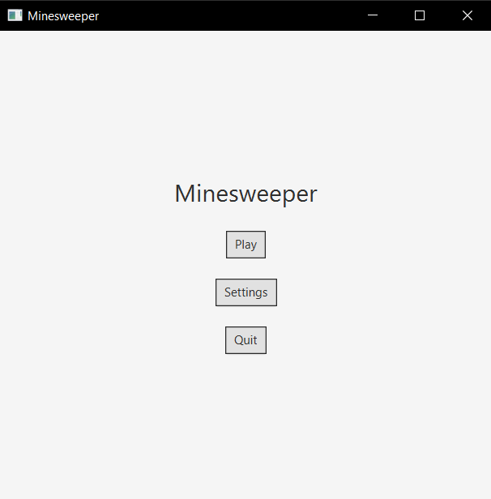
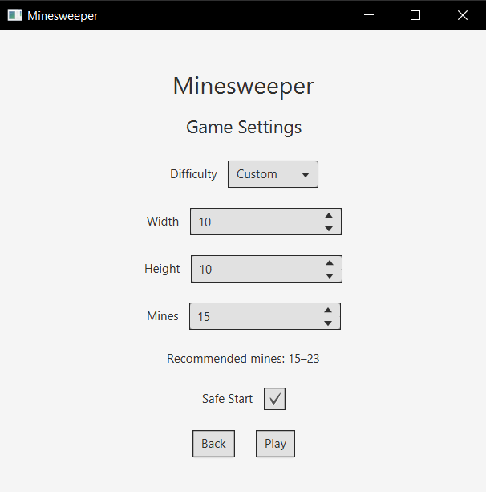
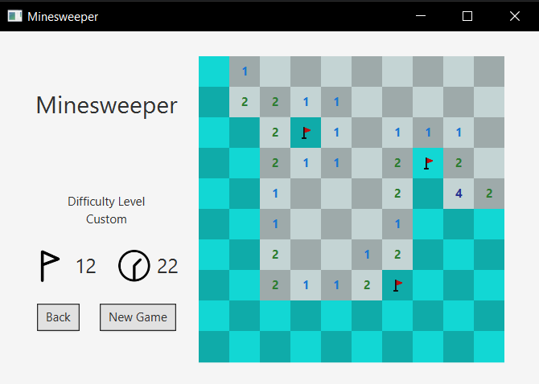

# Minesweeper


A desktop implementation of the classic **Minesweeper** game built with **Java 25** and **JavaFX**.

This project was developed to practice **object-oriented programming**, **JavaFX desktop application development**, and **project management with Maven**. It features multiple difficulty levels, customizable themes and languages, a game timer, and safe first-click mine generation.

---

## ✨ Features

* Four difficulty levels:
  * Easy
  * Medium
  * Hard
  * Custom
* Safe first click (the first revealed tile is guaranteed not to contain a mine)
* Random mines generation
* Flag placement system
* Automatic reveal of connected empty cells
* Flags counter
* In-game timer
* Multiple language support
* Theme support
* Persistent storage of user preferences (language and theme)
* JavaFX graphical user interface

---

## 🛠️ Technologies

* Java 25
* JavaFX
* Maven
* Maven Wrapper (`mvnw`)

---

## 📋 Requirements

* Java 25 or newer

No Maven installation is required, as the project includes the **Maven Wrapper**.

---

## 🚀 Installation

Clone the repository:

```bash
git clone https://github.com/ferl19/Minesweeper.git
cd Minesweeper
```

---

## ▶️ Running the Application

### Linux / macOS

```bash
chmod +x mvnw
./mvnw javafx:run
```

### Windows

```cmd
mvnw.cmd javafx:run
```

---

## 📁 Project Structure

```text
src/main/java
├── controller
├── generator
├── manager
├── model
└── view
```

### Package Overview

| Package      | Description                                   |
| ------------ | --------------------------------------------- |
| `controller` | Game flow and user interaction logic          |
| `generator`  | Minefield generation and board initialization |
| `manager`    | Application settings and resource management  |
| `model`      | Core game data structures                     |
| `view`       | JavaFX user interface components              |

---

## 📸 Screenshots

### Main Menu



### Game Settings



### Gameplay



---

## 💻 Author

Created by **ferl19**.
